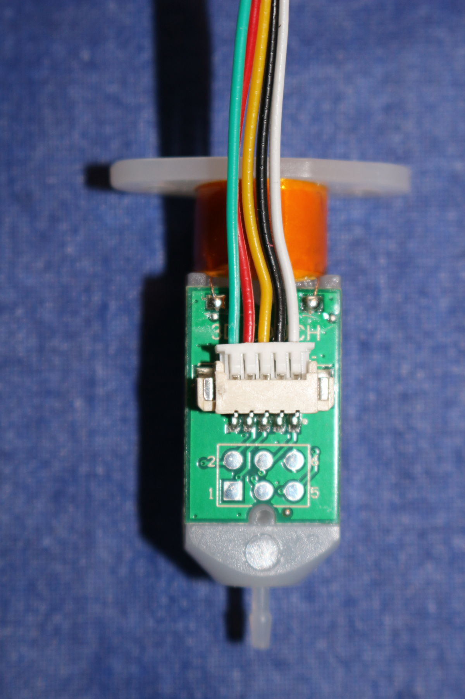

[retour](../README.md)


https://www.lesimprimantes3d.fr/forum/topic/10457-dagoma-bltouch/

# [BLTouch Anctlabs](https://www.antclabs.com/bltouch)


# 3D  Touch (aliexpress)  

Ce 3D Touch est compatible BLTouchdans le firmaware Marlin v2.8.  

## Notice  


## Installation  
Il faut connecter:
- la prise avec les deux fils noir(GND) et blanc(SIGNAL) sur **endstop Z-**
- la prise avec les trois fils vert(GND)/rouge(+5V)/jaune(signal) sur D11 (MKS Base 1.5)

Bien vérifier le brnachement avant allumage.
Puis tester le fonctionnement via les menus à l'écran.

Attention sur d'autres cartes la connectique est différente:
la prise avec les trois fils rouge(+5V)/vert(GND)/jaune(signal)





## Marlin 2.x

```
// Mechanical endstop with COM to ground and NC to Signal uses "false" here (most common setup).
#define X_MIN_ENDSTOP_INVERTING false // Set to true to invert the logic of the endstop.
#define Y_MIN_ENDSTOP_INVERTING false // Set to true to invert the logic of the endstop.
#define Z_MIN_ENDSTOP_INVERTING false // Set to true to invert the logic of the endstop.
#define X_MAX_ENDSTOP_INVERTING false // Set to true to invert the logic of the endstop.
#define Y_MAX_ENDSTOP_INVERTING false // Set to true to invert the logic of the endstop.
#define Z_MAX_ENDSTOP_INVERTING false // Set to true to invert the logic of the endstop.
#define Z_MIN_PROBE_ENDSTOP_INVERTING false // Set to true to invert the logic of the probe.


//#define FIX_MOUNTED_PROBE
#define BLTOUCH

#define NUM_SERVOS 1
#define SERVO_DELAY { 300 }
```